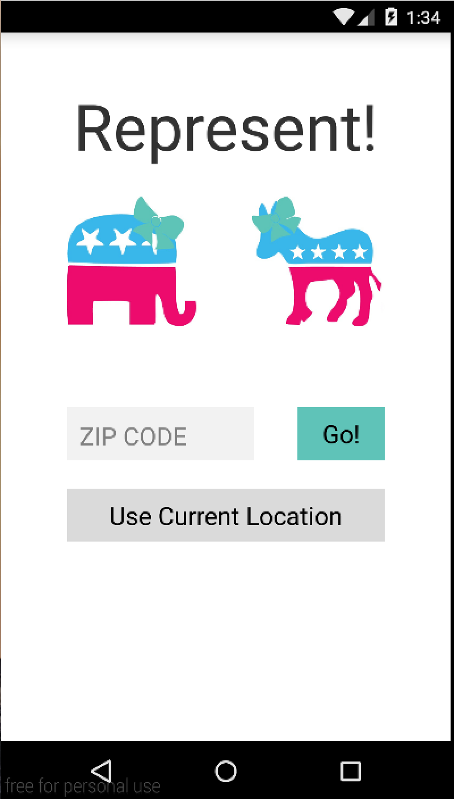
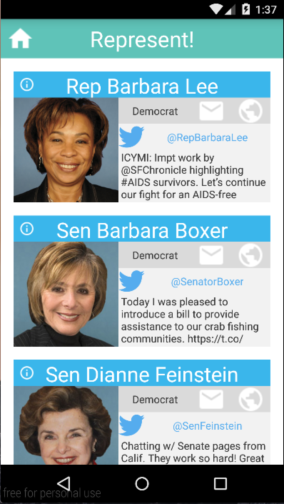
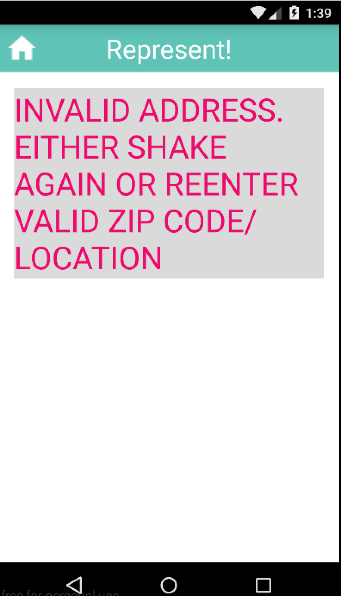
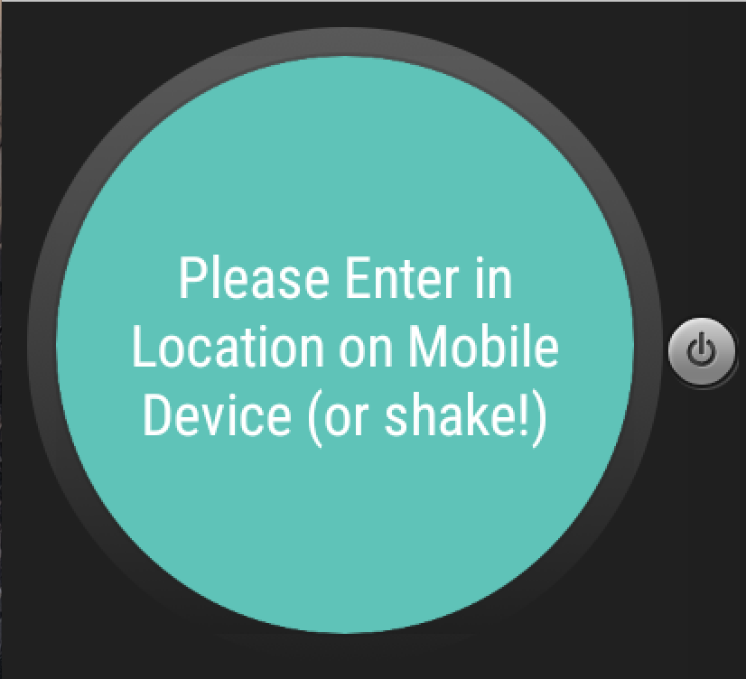
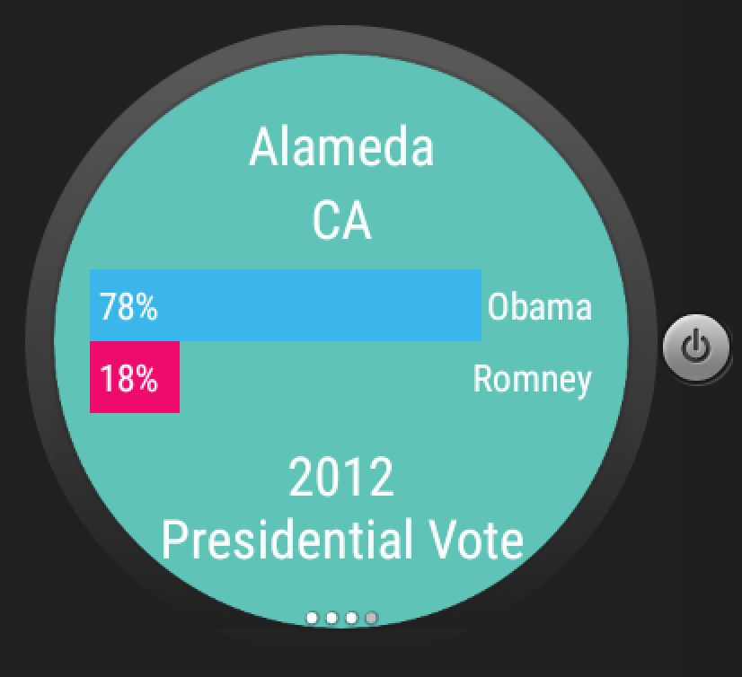

# PROG 02: Represent!

Briefly describe your app here.

## Authors

Robin Hu ([robinhu510@berkeley.edu](mailto:robinhu510@berkeley.edu))

## Demo Video

See [Represent!] (https://youtu.be/cCqyaBto7ZM)

## Screenshots

## Acknowledgments

* Hat tip to anyone who's code was used
* Any other support
